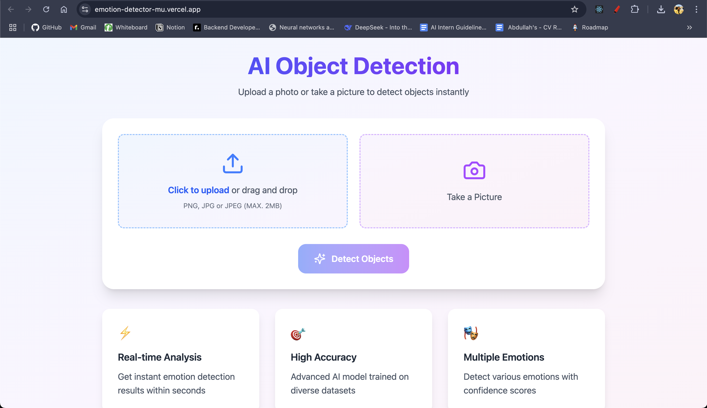
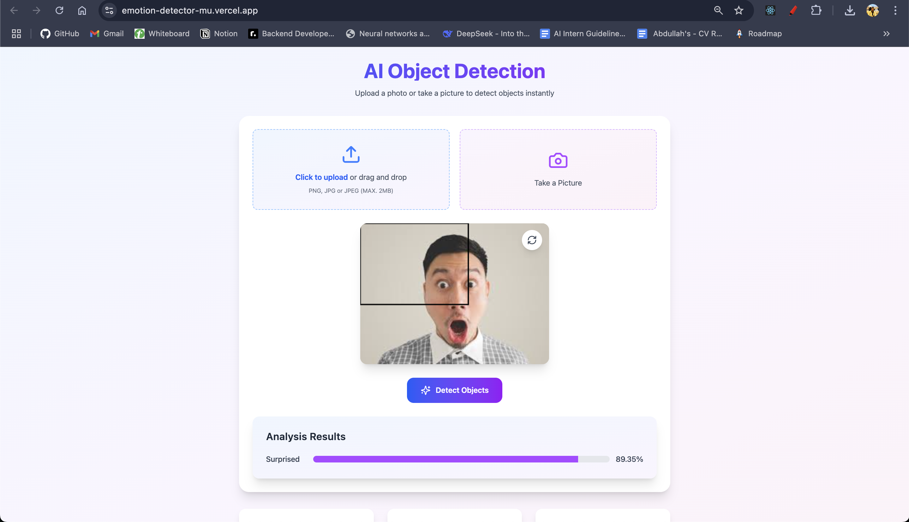

# AI-Powered Emotion Detection System: YOLO

This AI-powered Emotion Detection System is built with a FastAPI backend and a React (Vite) frontend. The backend utilizes YOLO (You Only Look Once) for object detection, while the frontend enables users to upload images and receive instant emotion detection feedback. The system processes images, recognizes emotions, and highlights detected faces with labeled bounding boxes. Designed for high performance, precision, and user convenience, it is ideal for real-time emotion analysis. The backend is hosted on Render, and the frontend is deployed on Vercel.

It would look something like the below one:<br>
# 1- when the user uploads his picture in the ui:<br>
<br>
# 2- The picture to upload<br>
<br>
# 3- The Output of the yolo model, The model predicting and classifying the image as surprised:<br>
<br>

## Frontend Setup

This section guides you through setting up and running the React frontend for the Emotion Detection System.

1.  **Clone the repository**

    First, clone the frontend repository from GitHub:

    ```sh
    git clone https://github.com/abdullah75f/ImageClassification.git
    ```

2.  **Navigate to the project directory**

    Change your current directory to the `ImageClassification` folder:

    ```sh
    cd ImageClassification
    ```

3.  **Navigate to the frontend directory**

    Change your current directory to the `image-classifier` folder:

    ```sh
    cd image-classifier
    ```

4.  **Install the dependencies**

    Install all required npm packages using:

    ```sh
    npm install
    ```

    This command reads the `package.json` file and installs all listed dependencies, including React, Vite, and other necessary libraries.

5.  **Run the development server**

    Start the React development server using:

    ```sh
    npm run dev
    ```

    This command starts the Vite development server, which typically runs on `http://localhost:5173`. The server provides hot-reloading, so changes in the code will be automatically reflected in the browser.

6.  **Accessing the Application**

    Once the development server is running, open your web browser and navigate to the address provided by the command line (usually `http://localhost:5173`). You should now see the Emotion Detection frontend.

## Backend Guide: The FastAPI

This is a FastAPI-based backend for real-time object detection using the YOLO model.

### Features

- Upload images and detect objects with bounding boxes.
- Uses **YOLO** for object detection.
- FastAPI for the backend.
- CORS support for frontend integration.

### Requirements

- Python 3.8+
- FastAPI
- Uvicorn
- PyTorch
- OpenCV
- NumPy
- Ultralytics YOLO

### Installation

1.  **Clone the repository**

    ```sh
    git clone https://github.com/abdullah75f/ImageClassification.git
    ```

2.  **Navigate to the project directory**

    ```sh
    cd ImageClassification
    ```

3.  **Navigate to the backend directory**

    ```sh
    cd backend
    ```

4.  **Create a virtual environment (recommended)**

    ```sh
    python -m venv .venv
    ```

5.  **Activate the virtual environment**

    - **Linux/macOS:**

      ```sh
      source .venv/bin/activate
      ```

    - **Windows:**

      ```sh
      .venv\Scripts\activate
      ```

6.  **Install the dependencies**

    ```sh
    pip install -r requirements.txt
    ```

### Running the API

```sh
uvicorn main:app --reload
```
